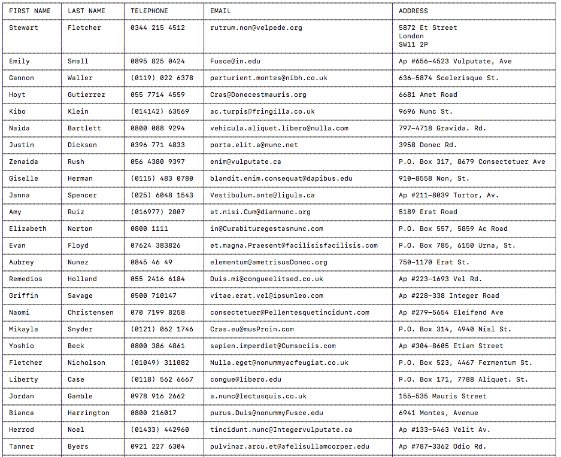
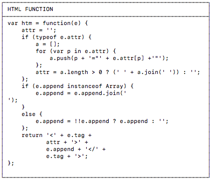

# GENERATE TABLE

## Details

The function will accept a JavaScript object with the following properties:

| Name | Type | Required | Comment |
| :---- | :----: | :----: | :------ |
| `data` | Array | true | an array of arrays detailing the rows and columns of the table. |
| `markdown` | Boolean | false | will default to ASCII table if not set (or set to `false`). |
| `headers` | Boolean | false | will convert top row to uppercase if set to `true`. |


```javascript
var data = [
    [ 'Name',    'Age' ],
    [ 'Richard', '30' ],
    [ 'John',    '31' ],
];

genTable({
    data:     data,
    markdown: false,
    headers:  false
});
```

The function will calculate max the width of each column and then the height of each row (line breaks within a cell). This will then allow the size of the table to be calculated. Any text that is not as wide as the max value will be increased with spaces.

Special characters should not be put into the cells (e.g. arrows, emojis) as they are not a standard width and can not be accounted for.

If the cells contain any tab `\t` characters they will be replace by **4** space characters instead. This will keep the formatting of the text but make it easier to calculate the width.

If the `markdown` property is set to `true` then the table will be outputed in the standard Markdown format as shown below. This should not be used for tables with cells that contain line breaks.

```
| Name    | Age |
| ------- | --- |
| Richard | 30  |
| John    | 31  |
```

If the `headers` property is set to `true` the top row of the table will be set to uppercase. It is not expected that headers would contain line breaks.

## Examples

##### Table of data:



##### Captured data with header:



> **Note:** if including code in the table please ensure an special characters are negated e.g. `\n` as `\\n`


